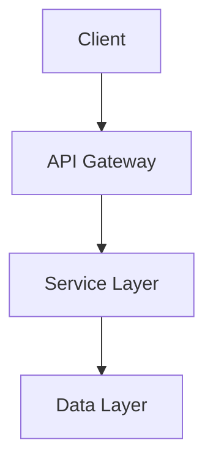
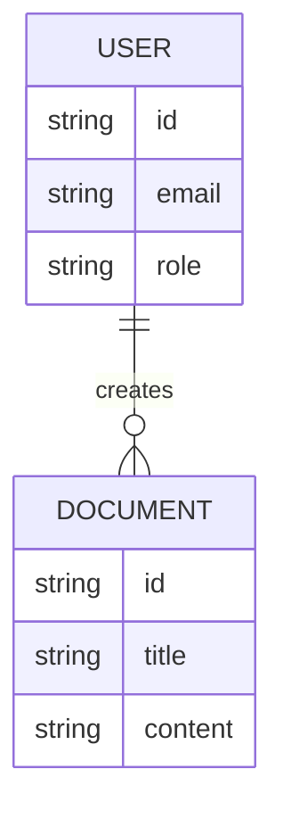

# Phase 4: Plan

Create technical implementation strategy based on clarified specification.

## Script Usage

```bash
# Setup plan phase
.specify/scripts/bash/setup-plan.sh --json

# Expected JSON output:
# {"FEATURE_SPEC": "/path/spec.md", "IMPL_PLAN": "/path/plan.md", "SPECS_DIR": "/path/specs", "BRANCH": "001-feature"}
```

## Documents to Create

### 1. Main Plan (`plan.md`)

```markdown
# Implementation Plan: [Feature Name]

## Technology Stack

### Frontend
- Framework: [Choice with rationale]
- State Management: [Choice with rationale]
- Styling: [Choice with rationale]

### Backend
- Language/Framework: [Choice with rationale]
- Database: [Choice with rationale]
- API Style: [REST/GraphQL/etc with rationale]

## Architecture

### System Overview



### Component Design

#### Component 1: [Name]
- **Responsibility**: [What it does]
- **Interfaces**: [APIs it exposes]
- **Dependencies**: [What it needs]

[Continue for all components...]

## Design Patterns

- [Pattern]: [Where and why used]

## Security Considerations

- Authentication: [Approach]
- Authorization: [Approach]
- Data Protection: [Approach]

## Performance Strategy

- Caching: [Strategy]
- Optimization: [Key areas]

## Error Handling

- Error types and handling strategies
- Logging and monitoring approach
```

### 2. Data Model (`data-model.md`)

```markdown
# Data Model

## Entity Relationship



## Schemas

### User
```typescript
interface User {
  id: string;
  email: string;
  role: 'admin' | 'editor' | 'viewer';
  createdAt: Date;
}
```

[Continue for all entities...]
```

### 3. API Contracts (`contracts/`)

Create API specifications:
- `api-spec.json` (OpenAPI/Swagger)
- `signalr-spec.md` (if using SignalR)
- Other contract definitions

### 4. Research (`research.md`) - Optional

Document technology investigations:

```markdown
# Research: [Topic]

## Options Evaluated

### Option 1: [Technology]
**Pros**: [Benefits]
**Cons**: [Drawbacks]
**Fit**: [How well it matches our needs]

### Option 2: [Technology]
[Same structure...]

## Recommendation

[Chosen option with rationale]

## References

- [Source 1]
- [Source 2]
```

### 5. Quick start (`quickstart.md`) - Optional

Setup instructions for developers.

## Alignment Check

Before finalizing:
- ✅ Does plan address all requirements?
- ✅ Does it follow constitution principles?
- ✅ Are technical choices justified?
- ✅ Are dependencies identified?
- ✅ Is it implementable?
